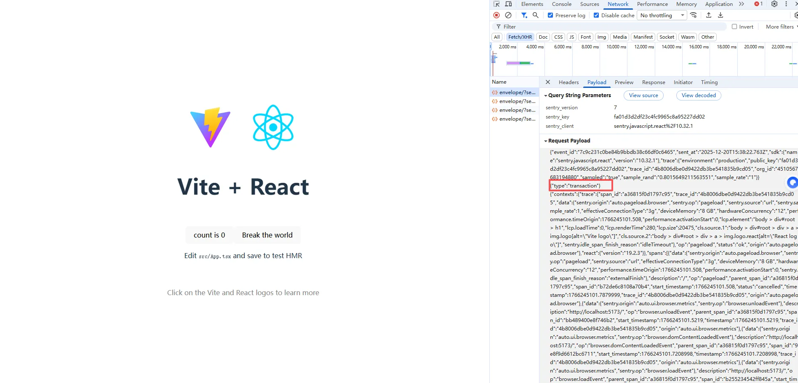

# 1. 初步使用

    按照官网的配置配即可，具体配置看官网。


    代码:使用js脚本引入到入口文件注册即可，不要放在useEffect。
    因为在开发中react严格模式，useEffect会执行两次，sentry住v额会报错
        captureConsoleIntegration：用于捕获控制台日志。​
        browserApiErrorsIntegration：捕获浏览器 API 报错。​
        feedbackIntegration：用于收集用户反馈。​
        httpClientIntegration：跟踪 HTTP 请求。

```ts
import * as Sentry from "@sentry/react";
Sentry.init({
  dsn: "https://fa01d3d2df23c4fc9965c8a95227dd02@o4510567683194880.ingest.de.sentry.io/4510567748665424",
  // 设置跟踪采样率, 介于 0.0 到 1.0 之间
  tracesSampleRate: 1.0,
  // For example, automatic IP address collection on events
  sendDefaultPii: true,
  integrations: [
    // 用于追踪用户交互的行为
    Sentry.browserTracingIntegration(),
    // 收集性能剖析数据
    Sentry.browserProfilingIntegration(),
    // 记录用户操作和重要事件（console、XHR、导航、用户交互），用于在错误发生时重建上下文。
    Sentry.breadcrumbsIntegration(),
    // 录制用户交互、DOM 快照和回放，重现用户操作流以复现前端 bug（通常作为附加产品/包引入）。
    Sentry.replayIntegration({
      maskAllText: false,
    }),
  ],
  // Session Replay
  replaysSessionSampleRate: 0.1, // This sets the sample rate at 10%. You may want to change it to 100% while in development and then sample at a lower rate in production.
  replaysOnErrorSampleRate: 1.0, // If you're not already sampling the entire session, change the sample rate to 100% when sampling sessions where errors occur.
});
```

# 2. 查看的配置的 integrations 是否生效

- 看 sentry 网址
- 看 sentry 请求的 type
  
