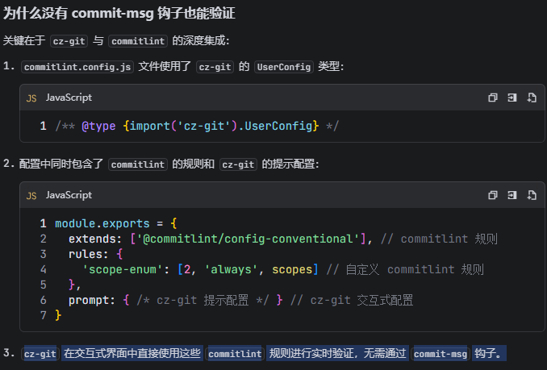

# 1. 初始化项目

```JS
pnpm init
```

# 2. 项目结构搭建：

模仿 sentry

# 3. 创建 workspace(工作空间) ：

&emsp;&emsp;创建 pnpm-workspaces.yaml,进行配置：[pnpm-workspaces.yaml](../pnpm-workspace.yaml)

# 4. 配置项目启动脚本:

[package.json](../package.json)

# 5. 开始 eslint, 安装 eslint 的相关插件

- 老版本的配置文件（CommonJS 格式）：.eslintrc.cjs、.eslintignore;
- 新的 Flat Config 格式配置文件采用：eslint.config.js
  @eslint/js 的作用 : 这个包主要是为了支持 Flat Config 格式而提供的，包含了默认规则集等。在您当前使用的旧配置格式中， eslint:recommended 已经可以直接访问这些规则，无需额外安装 @eslint/js

1. 安装插件
   ` 怎么快速的找到对应版本的插件配合使用：使用官方的cli创建eslint的项目，然后根据它使用的插件版本来安装插件`

```js
   "@eslint/js": "^9.39.1",
    "@types/node": "^24.10.1",
    "eslint": "^9.39.1",
    "eslint-plugin-react-hooks": "^7.0.1",
    "eslint-plugin-react-refresh": "^0.4.24",
    "globals": "^16.5.0",
    "typescript": "~5.9.3",
    "typescript-eslint": "^8.46.4",
    "eslint-plugin-simple-import-sort": "^12.1.1" //要进行eslint的plugin配置
```

2. 进行配置文件配置：[eslint.config.js](../eslint.config.js)
3. 脚本配置：只要运行脚本就可以进行 eslint 检查，有eslint错误没有系统报错就是eslint成功

```json
"scripts": {
    "test": "echo \"Error: no test specified\" && exit 1",
    "lint": "eslint . --ext .js,.jsx,.ts,.tsx --report-unused-disable-directives --max-warnings 0",
    "lint:fix": "eslint . --ext .js,.jsx,.ts,.tsx --fix --report-unused-disable-directives --max-warnings 0"
  },
```

4. 本地：安装eslint插件

- 规则先根据项目的配置文件，然后才根据vscode的配置文件

# 6. 兼容eslint的规则，格式化代码

1. 安装：

```js
"prettier": "^3.3.3", // 格式化工具核心包
"eslint-config-prettier": "^9.1.0", // 解决 ESLint 与 Prettier 规则冲突
```

2. 更新 package.json 添加 Prettier 脚本

```json
"scripts": {
    "prettier": "prettier --write ."
  },
```

3. 配置prettier 配置文件：[.prettierrc.json](../.prettierrc.json)
4. 创建.prettierignore忽略文件（忽略不需要格式化的文件）：[.prettierignore](../.prettierignore)

5. 添加 prettier 配置，禁用与 prettier 冲突的规则: [eslint.config.js](../eslint.config.js)

6. 测试生效：运行 prettier 脚本，格式化项目代码

- 本地上线：安装Prettier - Code formatter 插件。 设置保存代码看是否自动格式化（编辑器要配置自动格式化）
- 可以配置本地vscode文件： [settings](../.vscode/settings.json)
- 格式化规则根据项目的prettier 配置文件，然后才根据vscode的配置文件

# 7. 拼写检查

- 官网：https://cspell.org/docs/getting-started
- 有点恶心，谨慎使用
- 插件：CSpell Bundled Dictionaries - Code Spell Checke

1. package.json 更新 ：

- 安装 cspell
- 新增 spellcheck 脚本用于运行拼写检查，自定义单词
- cspell 配置文件 ：

# 8. Commit 信息规范

## 1. 安装

```js
    "lint-staged": "^15.2.10",
    "commitizen": "^4.3.1",
    "cz-git": "^1.10.1",
    "@commitlint/cli": "^19.6.1",
    "@commitlint/config-conventional": "^19.6.0"
```

&emsp;&emsp;这四个工具是实现完整 Commit 信息规范的核心组件，各自承担不同的职责，协同工作确保团队提交信息的一致性：

1. commitizen:交互式 Commit 信息生成器

- 作用 ：提供友好的交互式命令行界面，引导用户按照规范填写 commit 信息
- 特点 ：通过问答式界面帮助用户选择提交类型、范围、描述等
- 用法 ：执行 pnpm commit 启动界面
- 核心价值 ：避免手动输入不规范的 commit 信息

2. cz-gi:Commitizen 的自定义适配器

- 作用 ：是 commitizen 的一个插件，用于自定义 commit 规范
- 特点 ：支持中文提示、自定义 commit 类型、智能补全分支信息等
- 优势 ：相比默认适配器 cz-conventional-changelog 更灵活，支持多语言和个性化配置
- 配置文件 ：通过 cz-git.config.js 自定义规范

3. @commitlint/cli:Commit信息验证工具

- 作用 ：命令行工具，用于验证 commit 信息是否符合规范
- 特点 ：可以通过 git hooks（如 commit-msg）自动触发
- 用法 ：执行 npx commitlint --edit <commit-message-file>
- 核心价值 ：强制团队成员遵循统一的 commit 规范

4.  @commitlint/config-conventional:标准 Commit 规范配置

- 作用 ：提供一套业内广泛使用的标准 commit 规范配置
- 特点 ：基于 Angular 团队的 commit 规范，包括 type（feat/fix 等）、scope、subject 等字段
- 用法 ：作为 @commitlint/cli 的配置扩展
- 常见类型 ：feat（新增功能）、fix（修复 bug）、docs（文档）、style（格式）、refactor（重构）等

5. 协同工作流程
   1. 用户执行 pnpm commit ，通过 commitizen + cz-git 的交互式界面生成符合规范的 commit 信息
   2. git hooks 触发 @commitlint/cli 验证 commit 信息
   3. @commitlint/cli 使用 @commitlint/config-conventional 定义的规则进行验证
   4. 验证通过才能成功提交，否则提示错误

```text
  - @commitlint/cli 、 @commitlint/config-conventional ：用于检查提交信息规范，保证提交历史清晰，便于项目维护。
  - commitizen 、 cz-git ：提供交互式提交体验，使用 emoji 增强可读性。
```

## 2. cz-git的配置

1. 修改 package.json 添加 config 指定使用的适配器 ：https://cz-git.qbb.sh/zh/guide/

```js
"config": {
    "commitizen": {
      "path": "node_modules/cz-git"
    }
  },
```

2. 启动命令

```js
 "commit": "cz"
```

4. 提交类型配置：cz-git.config.js

```js
module.exports = {
  language: 'zh-CN',
  messages: {
    type: '请选择提交类型:',
    scope: '请选择修改范围:',
    customScope: '请输入自定义修改范围:',
    subject: '请输入简短的提交描述:',
    body: '请输入详细描述:',
    breaking: '请输入不兼容变更:',
    footerPrefixesSelect: '请选择关联 issue 前缀:',
    customFooterPrefix: '请输入自定义 issue 前缀:',
    footer: '请输入关联 issue 编号:',
    confirmCommit: '确认提交信息?'
  },
  types: [
    { value: 'feat', name: 'feat: 新增功能' },
    { value: 'fix', name: 'fix: 修复 bug' },
    { value: 'docs', name: 'docs: 文档变更' },
    { value: 'style', name: 'style: 代码格式' },
    { value: 'refactor', name: 'refactor: 重构' },
    { value: 'perf', name: 'perf: 性能优化' },
    { value: 'test', name: 'test: 测试' },
    { value: 'build', name: 'build: 构建' },
    { value: 'ci', name: 'ci: CI/CD' },
    { value: 'chore', name: 'chore: 其他变更' },
    { value: 'revert', name: 'revert: 回滚' }
  ]
}
```

4. 为什么使用cz-git而不是cz-conventional-changelog
   https://cz-git.qbb.sh/zh/guide/why

5. 创建[commitlint.config.js]

```JS
module.exports = {
  extends: ['@commitlint/config-conventional']
}
```

- 如果里面配置了rules、prompt（cz-git 的交互式提示配置），那么就没必要配置cz-git.config.js：[commitlint.config.js](../commitlint.config.js)

# 9. Husky 配置

&emsp;&emsp;husky是一个git hook工具，可以帮助我们触发git提交的各个阶段：pre-commit -> commit-msg-> pre-push

1. 按照husky

```js
npx husky-init
pnpm i

```

2. lint-staged： 格式化要暂存区的文件

```js
yarn add -D lint-staged
```

- 创建 lint-staged.config.js（根目录）或者在package.json中配置

```js
module.exports = {
  //  --cache : 使用缓存，只处理修改过的文件
  // --write : 直接修改文件
  // --no-error-on-unmatched-pattern : 如果没有匹配到文件，不报错
  '*.{md,json}': ['prettier --cache --write --no-error-on-unmatched-pattern'],
  '*.{css,less}': ['prettier --cache --write'],
  // eslint --fix : 使用 ESLint 检查代码并自动修复一些问题
  // : 使用 Prettier 格式化代码
  '*.{js,jsx}': ['eslint --fix', 'prettier --cache --write'],
  // 使用 Prettier 格式化代码，并指定解析器为 TypeScript
  '*.{ts,tsx}': ['eslint --fix', 'prettier --cache --parser=typescript --write']
}
```

3. 协同工作流程

- 用户执行 pnpm commit ：
  - 这会启动 commitizen 工具，结合 cz-git(读取 commitlint.config.js 中的配置) 适配器提供交互式界面
  - 用户通过问答式界面选择提交类型、范围、输入描述等信息
  - 最终生成符合规范的 commit 信息
- 触发pre-commit钩子，执行npx lint-staged
  - 当用户确认 commit 信息后，Git 会触发 .husky/pre-commit 钩子
  - 钩子执行 npx lint-staged 命令
  - lint-staged 根据 package.json 中的配置，对暂存区的文件执行相应的检查和格式化命令：
    - 对 Markdown 和 JSON 文件执行 Prettier 格式化
    - 对 CSS 和 LESS 文件执行 Prettier 格式化
    - 对 JavaScript 和 JSX 文件执行 ESLint 修复和 Prettier 格式化
    - 对 TypeScript 和 TSX 文件执行 ESLint 修复和 Prettier 格式化
  - Git 提交信息验证 触发 @commitlint/cli 验证 commit 信息
    
  - @commitlint/cli 会使用 @commitlint/config-conventional 定义的规则进行验证
  - 验证内容包括提交类型、范围、描述长度等是否符合规范
- 提交完成
  - 如果所有检查和验证都通过，Git 提交成功
  - 如果任何一个环节失败（如 lint-staged 检查不通过），提交会被中止，需要修复问题后重新提交
